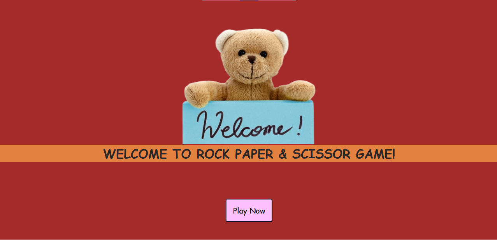
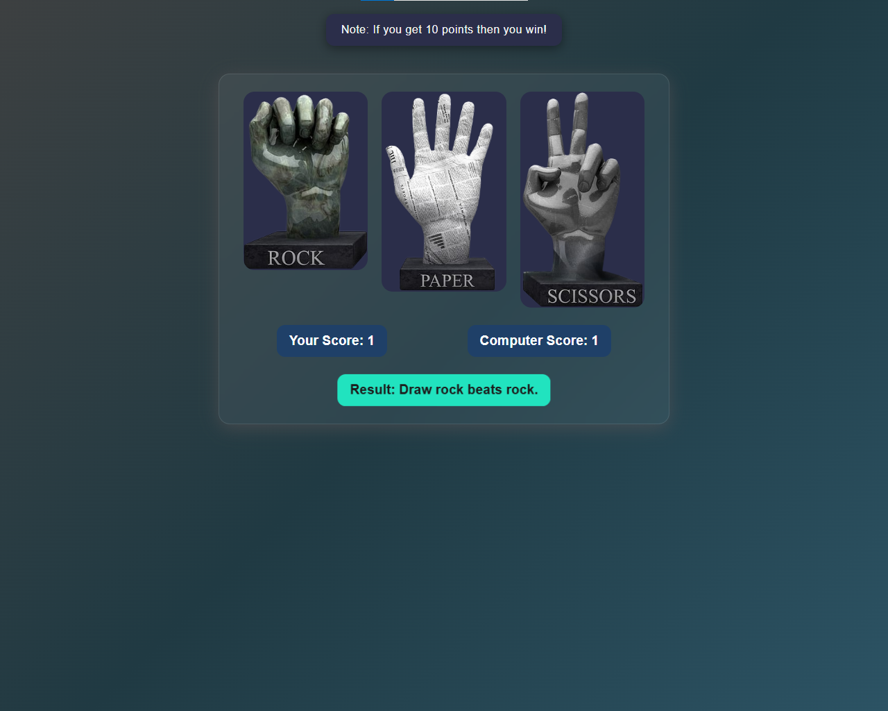
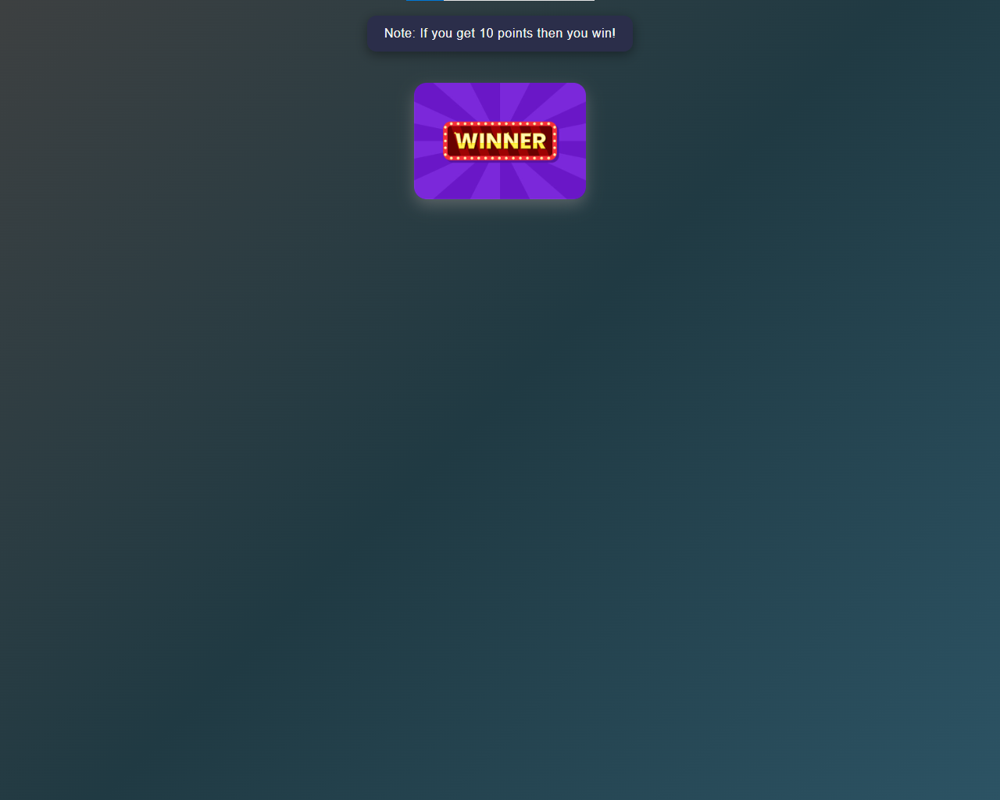

# ✂️ Scissor Game

A simple yet fun **Rock, Paper, Scissors** game built with **HTML, CSS, and JavaScript**.  
The project has **three pages**: a **Start Page**, a **Play Page**, and a **Result Page**.  
It’s designed with a clean UI, smooth gameplay, and responsive layout for both desktop and mobile.  

---

## 🚀 Features
- 🎮 **Start Page**: Welcome screen with "Start Game" button.  
- ✋ **Play Page**: User can select **Rock, Paper, or Scissors**.  
- 🤖 Computer generates a random choice each round.  
- ✅ **Result Page**:
  - Shows **Success (You Win)** if user wins.
  - Shows **Lose (Computer Wins)** if computer wins.  
- 📊 Score tracking between user and computer.  
- 🎨 Modern and responsive UI.  
- 🔊 Optional sound effects for clicks and win/lose results.  

---

## 🛠️ Technologies Used
- **HTML5** – structure  
- **CSS3** – styling and animations  
- **JavaScript (ES6)** – game logic  

---

## 📸 Demo & Preview

👉 **Live Demo**: [Play Here](https://rock-paper-scissors-game-javascript.netlify.app/)  

👉 **Preview Screenshot**:  


    
    

---

## 📂 Project Structure
Rock-Paper-Scissor-Game/
│── index.html # Start Page
│── play.html # Play Page
│── result.html # Result Page
│── style.css # Styles
│── script.js # Game logic
│── Images/ # Rock, Paper, Scissor images
│── sounds/ # (Optional) Sound files


---

## ⚙️ Installation
1. Clone this repository:
   ```bash
   git clone https://github.com/dharamdan01/rock-paper-scissor-game.git

---


## 👨‍💻 Developer
1. Name: Dharam Dan
2. GitHub: dharamdan01
